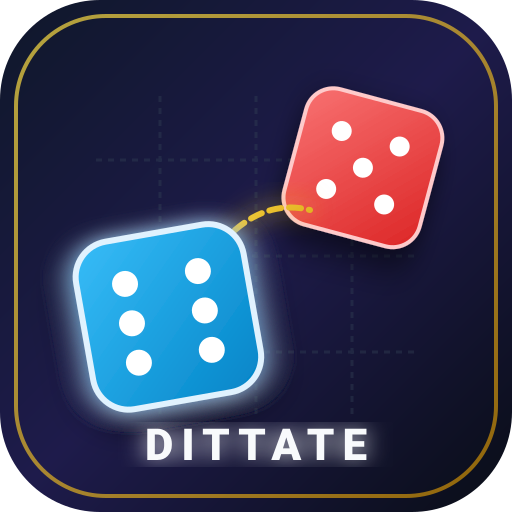
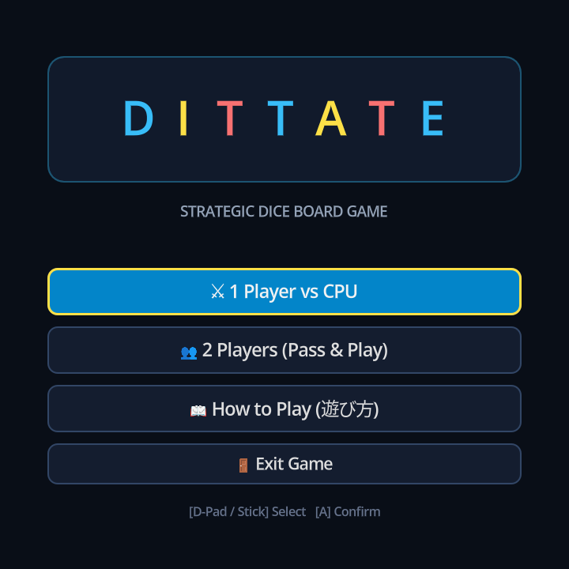
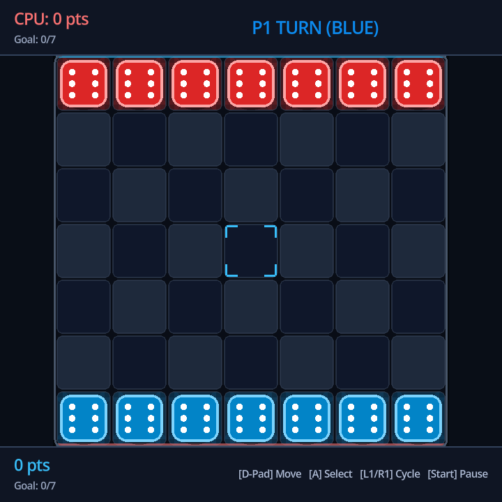
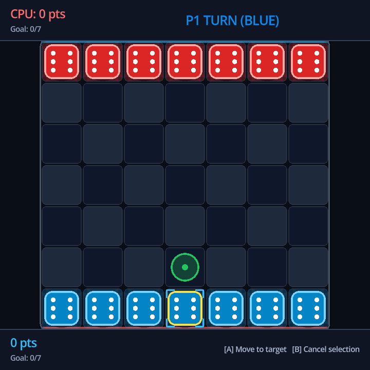
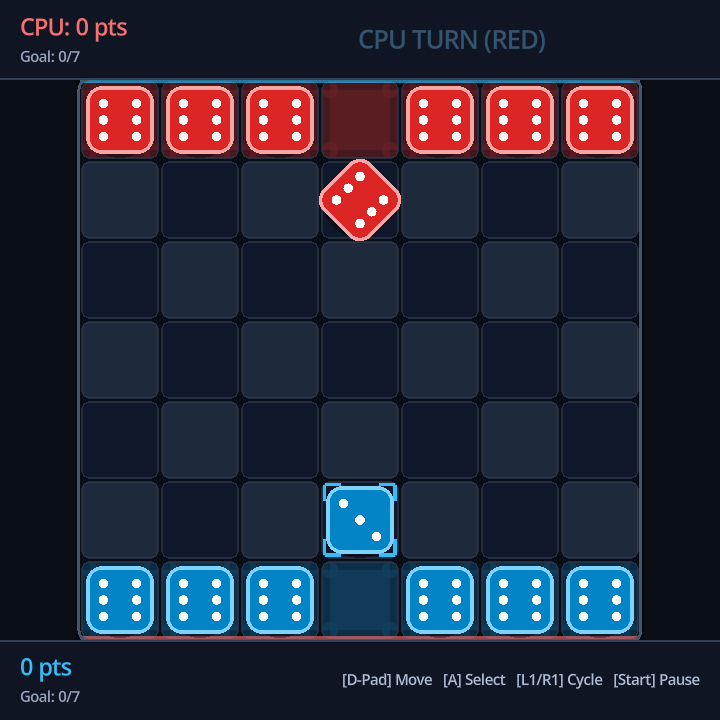

# 🎲 Dittate (ディテイト)

<p align="center">
  <br>
  <strong>ANBERNIC RG Rotate (720x720 1:1 Display) 向け戦略サイコロ対戦ボードゲーム</strong>
</p>

---

## 📸 スクリーンショット (720x720 実機画面)

<p align="center">
  
  &nbsp;&nbsp;
  
</p>
<p align="center">
  <em>タイトル画面（ゲームパッドナビゲーション） / 7x7 盤面初期配置（P1青 / CPU赤）</em>
</p>

<p align="center">
  
  &nbsp;&nbsp;
  
</p>
<p align="center">
  <em>ダイス選択と移動可能マスハイライト（緑） / サイコロが転がり出目が変化（Top 6→3）＆CPU応答</em>
</p>

---

## 📖 概要
**Dittate** は、テーブルトップ名作ゲーム『Dittle』のルールをベースにした、Godot 4製の strategic dice board game（サイコロ戦略対戦ボードゲーム）です。  
ANBERNIC RG Rotate の **720x720 px 正方形ディスプレイ** と **完全物理ボタン / ゲームパッド操作** に最適化されています。

---

## 🎮 画面構成 & 特徴
- **720x720 (1:1) スクエアディスプレイ最適化**
  - **Top Bar (80px)**: 相手/CPUスコア・ゴール到達数・ターン状態インジケーター
  - **Center Board (560x560px)**: 7x7 グリッド盤面（角丸タイル・ゴール行ガイド・ネオンハイライト）
  - **Bottom Bar (80px)**: 自軍スコア・ゴール到達数・物理ボタン操作ヘルプバナー
- **プロシージャル2Dダイス描画 & アニメーション**
  - 出目（1〜6）のピップ（ドット）を動的描画
  - 転がり（Roll）時のスムーズな回転＆スクワッシュ、ジャンプ（Jump）時の放物線ホップ演出
- **思考AIプレイヤー搭載**
  - ゴール到達・天面の高得点化・前進・マルチジャンプを多角的に評価するヒューリスティックAI

---

## 📜 ゲームルール

### 1. 盤面と初期配置
- **7x7 グリッド**（座標 `(0,0)` 〜 `(6,6)`）
- **Player 1 (青/手前)**: ベース行 $Y=6$ に7個のダイス
- **Player 2 / CPU (赤/奥)**: ベース行 $Y=0$ に7個のダイス
- **D6ダイスの初期配置**:
  - 対面の和は7（1-6, 2-5, 3-4）
  - 初期向き: **天面 (Top) = 6**, **前面 (Front: 相手向き) = 4**, 底面 = 1, 背面 = 3, 左面 = 5, 右面 = 2

### 2. 移動ルール（後退禁止）
サイコロは **前進（相手方向）・左・右** の3方向にのみ移動できます。（**後退は禁止**）  
毎ターン1つのサイコロを選択し、以下のアクションを行います：

1. **Tilt (Roll / 転がり)**:
   - 隣接する空きマスへ1マス進む。サイコロが90度転がり、天面の出目が変化します。
2. **Jump (飛び越え)**:
   - 前・左・右に隣接するサイコロ（自他問わず）を飛び越えて、2マス先の空きマスへ着地します。
   - **ジャンプ中はサイコロは回転せず、出目をそのまま維持します。**
3. **Chain Jump (連続ジャンプ)**:
   - ジャンプ着地後、さらに飛び越え可能なサイコロがあれば1手番中に連続でジャンプできます。
4. **Tilt-then-Jump Combo (転がり＋ジャンプ)**:
   - 1マスRollした直後、着地点から連続してJumpを実行できます。
- ※サイコロが盤面から取られたり除外されることはありません。

### 3. ゲーム終了 & 勝敗判定
- **終了条件**: いずれかのプレイヤーが **7個すべてのサイコロを相手のベース行（P1はY=0、P2はY=6）に到達させた瞬間** に即時終了します。
- **スコア計算**: 相手ベース行に配置されている自軍サイコロの **天面（Top）の合計点**。
- スコアが高いプレイヤーの勝利となります（同点は引き分け）。

---

## 🕹️ 操作方法 (RG Rotate / Gamepad / Keyboard / Touch)

| 操作 | ゲームパッド (RG Rotate) | キーボード | タッチ操作 |
| :--- | :--- | :--- | :--- |
| **カーソル移動** | D-Pad / 左アナログスティック | 矢印キー / W A S D | タップで指定 |
| **サイコロ選択 / 移動決定** | **A ボタン** (Joypad 0) | **Enter** / **Space** | ダイス / ハイライトをタップ |
| **選択解除 / 戻る** | **B ボタン** (Joypad 1) | **Escape** / **Backspace** | 盤面外をタップ |
| **サイコロ巡回選択** | **L1 / R1** (Joypad 9/10, 4/5) | **Q / E** | - |
| **ポーズ / メニュー** | **Start ボタン** (Joypad 6/11) | **P / Escape** | - |

---

## 📁 プロジェクト構成

```
dittate/
├── icon.svg               # dittate専用アプリアイコン
├── project.godot           # 解像度720x720, 入力マップ, プロジェクト設定
├── export_presets.cfg     # Android エクスポートプリセット設定
├── docs/
│   └── screenshots/       # 実機スクリーンショット画像 (PNG)
│       ├── title.png
│       ├── gameplay_start.png
│       ├── move_highlight.png
│       └── gameplay_action.png
├── scenes/
│   ├── Title.tscn         # タイトル画面（アニメーションロゴ & メニュー）
│   ├── HowToPlay.tscn     # ルール・操作説明画面
│   ├── Board.tscn         # 7x7 グリッド描画 & ハイライト
│   ├── Dice.tscn          # プロシージャル2Dダイス & アニメーション
│   └── Main.tscn          # 対戦メインループ & UI & ポーズ/ゲームオーバー
├── scripts/
│   ├── DittleLogic.gd     # 3Dダイス回転数学, 合法手探索, スコア計算
│   ├── AIPlayer.gd        # ヒューリスティック評価AI
│   ├── Title.gd           # タイトル制御
│   ├── HowToPlay.gd       # 遊び方制御
│   ├── Board.gd           # 盤面・カーソル・ハイライト制御
│   ├── Dice.gd            # ダイス描画・Tween制御
│   └── Main.gd            # ゲーム進行・入力ハンドリング
└── tests/
    ├── test_logic.gd      # ロジック単体テスト
    ├── test_scenes.gd     # シーン検証テスト
    └── test_gameflow.gd   # ゲーム進行シミュレーションテスト
```

---

## 🛠️ ビルド & インストール手順

### 必要な環境
- Godot Engine 4.3+ (Forward+ / Mobile)
- Android SDK & Java 17 (APKビルド時)
- ADB (RG Rotate接続用)

### 1. 単体テスト実行 (CLI)
```bash
godot --headless --script tests/test_logic.gd
godot --headless --script tests/test_scenes.gd
godot --headless --script tests/test_gameflow.gd
```

### 2. Android APK のビルド
```bash
godot --headless --export-debug "Android" ./build/dittate.apk
```

### 3. RG Rotate へのインストール & 起動 (ADB)
```bash
# APKをインストール
adb install -r ./build/dittate.apk

# アプリを起動
adb shell monkey -p com.dittate.game -c android.intent.category.LAUNCHER 1
```